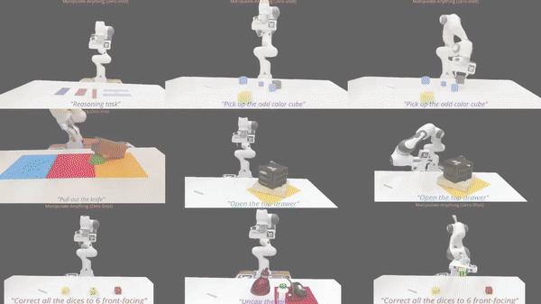

# Manipulate-Anything: Automating Real-World Robots using Vision-Language Models

*A scalable automated generation method for real-world robotic manipulation.*

[**Project Page**](https://robot-ma.github.io/) | [**Data**](https://drive.google.com/drive/folders/1bq3P8ywJkFMxemq9ywvj2b7LHsAhx2kg) | [**Paper**](https://robot-ma.github.io/MA_paper.pdf)

---

## Overview

**Manipulate-Anything** is a scalable automated generation method for real-world robotic manipulation. Unlike prior work, this method operates in real-world environments without privileged state information or hand-designed skills, enabling manipulation of any static object.



## Authors

[Jiafei Duan*](https://duanjiafei.com), [Wentao Yuan*](https://wentaoyuan.github.io), [Wilbert Pumacay](https://wpumacay.github.io), [Yi Ru Wang](https://helen9975.github.io/), [Kiana Ehsani](https://ehsanik.github.io/), [Dieter Fox](https://homes.cs.washington.edu/~fox), [Ranjay Krishna](https://ranjaykrishna.com)

## Table of Contents

- [Environment Setup](#environment-setup)
- [Data Generation](#data-generation)
- [Evaluation](#evaluation)
- [Citation](#citation)

---

## Environment Setup

To set up the Manipulate-Anything environment, you will need four repositories, including this one.

### 1. Create Conda Environment

```bash
conda env create -n manip_any python=3.11
conda install cuda -c nvidia/label/cuda-11.7.0
conda activate manip_any
```

2. Setup and install Manipulate-Anything-QWenVL
Go into the [QWen-VL-MA](https://github.com/Robot-MA/QWen-VL-MA) and follow the steps.

3. Install PyRep
PyRep requires version **4.1** of CoppeliaSim. Download: 
- [Ubuntu 16.04](https://www.coppeliarobotics.com/files/CoppeliaSim_Edu_V4_1_0_Ubuntu16_04.tar.xz)
- [Ubuntu 18.04](https://www.coppeliarobotics.com/files/CoppeliaSim_Edu_V4_1_0_Ubuntu18_04.tar.xz)
- [Ubuntu 20.04](https://www.coppeliarobotics.com/files/CoppeliaSim_Edu_V4_1_0_Ubuntu20_04.tar.xz)

Once you have downloaded CoppeliaSim, you can pull PyRep from git:

```bash
cd <install_dir>
git clone https://github.com/stepjam/PyRep.git
cd PyRep
```

Add the following to your *~/.bashrc* file: (__NOTE__: the 'EDIT ME' in the first line)

```bash
export COPPELIASIM_ROOT=<EDIT ME>/PATH/TO/COPPELIASIM/INSTALL/DIR
export LD_LIBRARY_PATH=$LD_LIBRARY_PATH:$COPPELIASIM_ROOT
export QT_QPA_PLATFORM_PLUGIN_PATH=$COPPELIASIM_ROOT
```

Remember to source your bashrc (`source ~/.bashrc`) or 
zshrc (`source ~/.zshrc`) after this.

**Warning**: CoppeliaSim might cause conflicts with ROS workspaces. 


4. Install current repo
```bash
pip install pointnet2_ops/
cd pointnet2_ops
pip install -r requirements.txt
pip install .
```

```bash
git clone https://github.com/Robot-MA/manipulate-anything.git
cd RLBench
pip install -r requirements.txt
python setup.py develop
```

## Data Generation

1. Download [checkpoint](https://drive.google.com/file/d/1ZK2IwhHcVk-hPEC0DSvtENYUi_n0lKYk/view?usp=sharing).
2. Setup GPT4V API-key.
```bash
meshcat-server
```  
4. Run meshcat server. 
```bash
export OPENAI_API_KEY="your_api_key_here"
```
4. Zero-shot data generation. Example task (Put_block_on_target):
```bash
python dataset_generator.py \
    eval.checkpoint=<PATH_TO_M2T2_CHECKPOINT> \
    eval.mask_thresh=0.0 \
    eval.retract=0.20 \
    rlbench.task_name=<TASK_NAME>
```
5. Open http://127.0.0.1:7000/static to see the visualization. Press enter in terminal to see the next pose generated.

## Evaluation


## Citation

If you find Manipulate-Anything useful for your research and applications, please consider citing our paper:
```bibtex
@article{duan2024manipulate,
  title={Manipulate-anything: Automating real-world robots using vision-language models},
  author={Duan, Jiafei and Yuan, Wentao and Pumacay, Wilbert and Wang, Yi Ru and Ehsani, Kiana and Fox, Dieter and Krishna, Ranjay},
  journal={arXiv preprint arXiv:2406.18915},
  year={2024}
}
```

